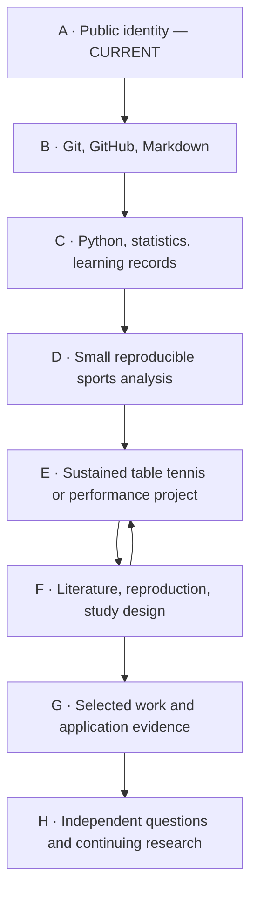

# Long-term roadmap / 四年路线

Current position: **A — Foundation and public identity**. See [CURRENT_STAGE.md](CURRENT_STAGE.md) for verified status.

The year labels describe a flexible sequence, not deadlines or guaranteed outcomes. Adjust to coursework, training demands, interests, and supervisor feedback.

| Stage | Main use / 主要用处 | Evidence to move forward |
|---|---|---|
| A | Make the learning direction legible / 清楚介绍自己 | Accurate profile, working repositories, progress record |
| B | Work independently with the archive / 会使用工具 | Explain and make a small edit, inspect history, understand rollback |
| C | Build transferable foundations / 建立基础 | Original exercises, checked calculations, short English explanations |
| D | Finish a bounded analysis / 做完一个小分析 | Question, permitted data, repeatable steps, chart, limitations |
| E | Investigate a meaningful sports question / 持续深化问题 | Defined measures, baseline, documented iterations and errors |
| F | Connect projects to research / 进入学术研究 | Source-linked literature notes, reproduction attempt, study critique |
| G | Select evidence for a specific opportunity / 整理申请材料 | Accurate role descriptions, selected results, concise research narrative |
| H | Sustain a research practice / 形成长期能力 | New questions, feedback, improved methods, reusable work |

## Flexible four-year emphasis

- **Year 1: A–D.** Prioritize university learning, English, Python, descriptive statistics, and one small completed analysis.
- **Year 2: D–E.** Develop one sports question over time; strengthen statistics and reproducibility. Add AI only when a defined question and baseline justify it.
- **Year 3: E–F.** Read related literature, attempt a bounded reproduction, and seek appropriate academic feedback or supervised research opportunities.
- **Year 4: F–G, continuing toward H.** Select the strongest genuine work and adapt the narrative to the actual program requirements. Archive evidence of your role and learning.

## Shared thread

Coursework and training → a question → a method → an inspectable artifact → feedback → revision.

English grows through short explanations of your own work. A portfolio records your development; its quality depends on the work and understanding behind it.
